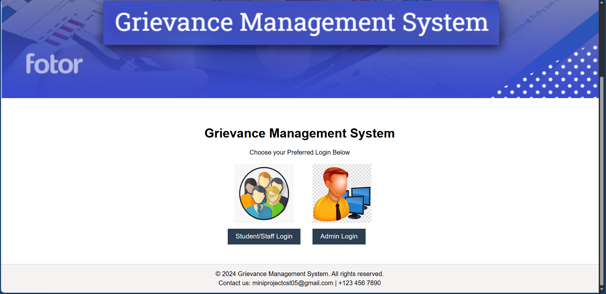
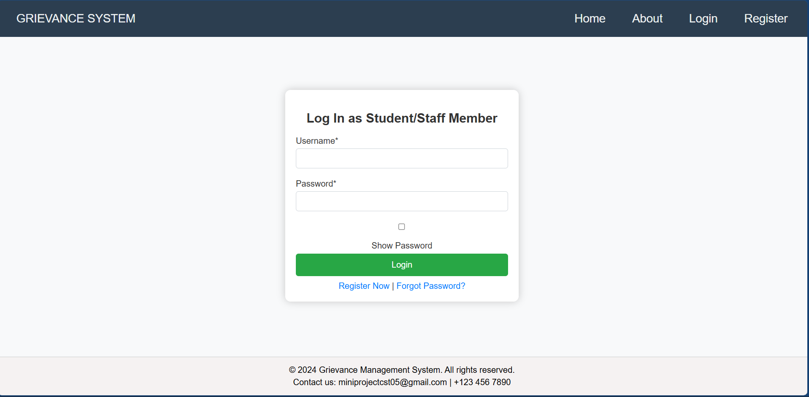
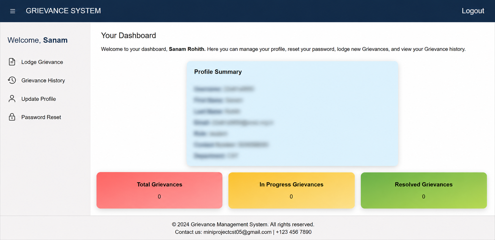
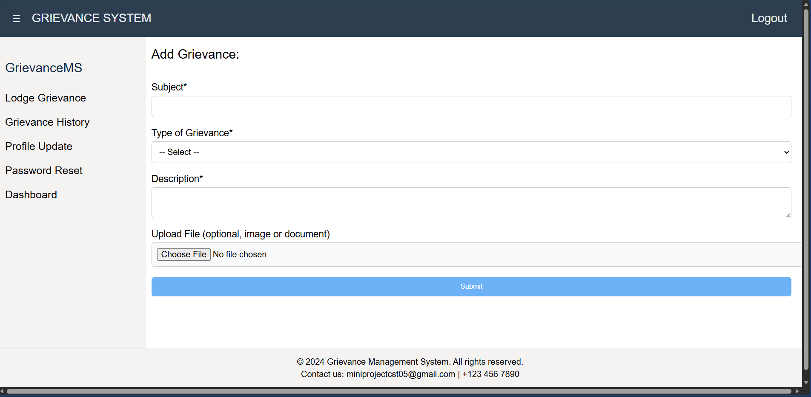
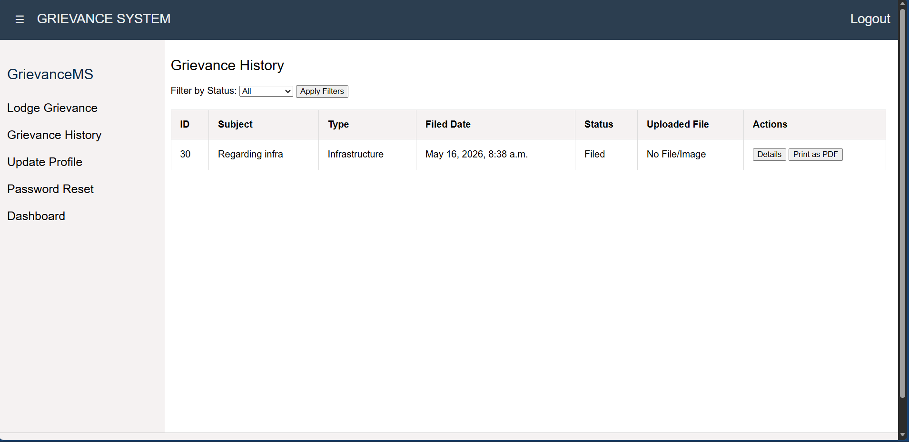
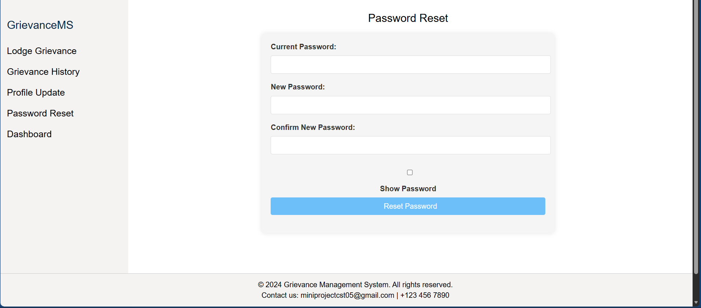
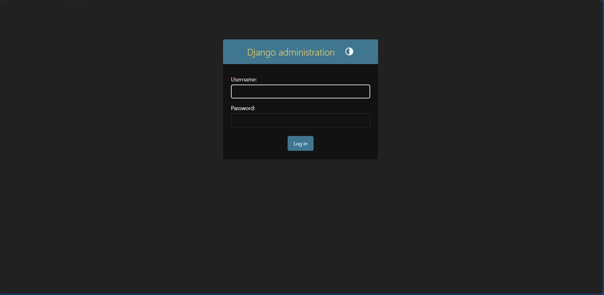
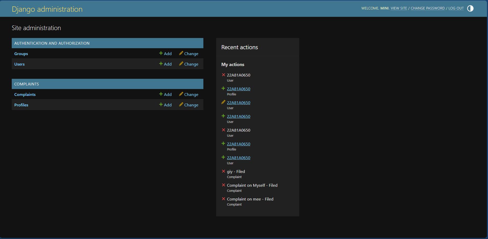
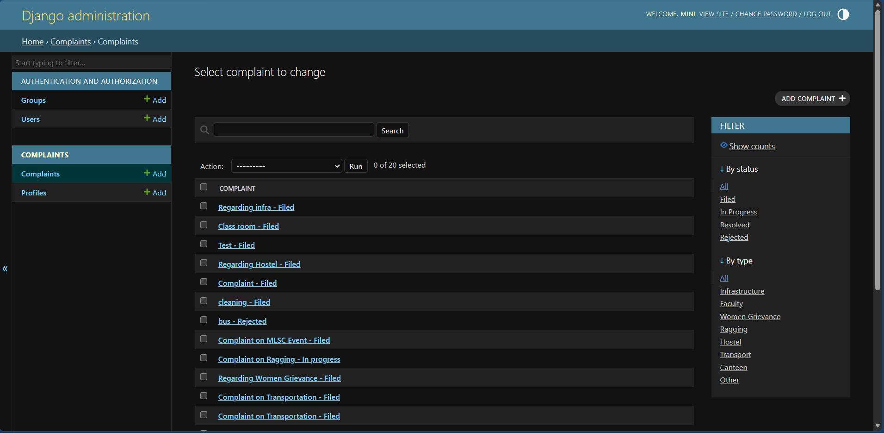

# Grievance Management System (GMS)

## Overview

The Grievance Management System is a Django-based web application developed to manage and track student grievances efficiently. The system provides a digital platform where users can register, log in, submit complaints, upload supporting documents, and monitor grievance status through an interactive dashboard. The application helps reduce manual paperwork and improves communication between students and administration.

---

# Features

* User Registration and Login Authentication
* Complaint/Grievance Submission
* Complaint Status Tracking
* File Upload Support
* User Profile Management
* Admin Dashboard
* Responsive User Interface
* Secure Database Management

---

# Technologies Used

* Python
* Django Framework
* SQLite Database
* HTML
* CSS
* Bootstrap

---

# Project Structure

```bash id="5m7b1u"
gms_project/
│
├── manage.py
├── db.sqlite3
├── templates/
├── static/
├── media/
├── app/
├── requirements.txt
└── README.md
```

---

# Installation and Setup

## Step 1: Clone the Repository

```bash id="bb8h9n"
git clone https://github.com/SanamRohith/grievance-management-system.git
```

---

## Step 2: Navigate to Project Folder

```bash id="f7w4xp"
cd gms_project
```

---

## Step 3: Create Virtual Environment

```bash id="p9n4xd"
python -m venv env
```

---

## Step 4: Activate Virtual Environment

### Windows

```bash id="j4w3nr"
env\Scripts\activate
```

### Mac/Linux

```bash id="jv4m2s"
source env/bin/activate
```

---

## Step 5: Install Dependencies

```bash id="3h2r7f"
pip install -r requirements.txt
```

---

## Step 6: Run Database Migrations

```bash id="x6v1kp"
python manage.py migrate
```

---

## Step 7: Start the Development Server

```bash id="n5k8dz"
python manage.py runserver
```

---

## Step 8: Open in Browser

```text id="r9c2tm"
http://127.0.0.1:8000/
```


# System Workflow

1. User Registration/Login
2. Complaint Submission
3. Complaint Data Stored in Database
4. Admin Reviews Complaint
5. User Tracks Complaint Status

---
# Project Screenshots

## Home Page


---

## User Login


---

## User Dashboard


---

## Lodge Grievance


---

## Grievance History


---

## Password Reset


---

## Admin Login


---

## Admin Dashboard


---

## Admin Complaint Management


# Objective

The main objective of this project is to provide an efficient digital solution for handling student grievances and complaint management through a secure and user-friendly web application.

---

# Future Enhancements

* Email Notification System
* AI-Based Complaint Categorization
* Real-Time Chat Support
* Advanced Analytics Dashboard
* Mobile Application Integration

---

# License

This project is developed for educational and academic purposes.
